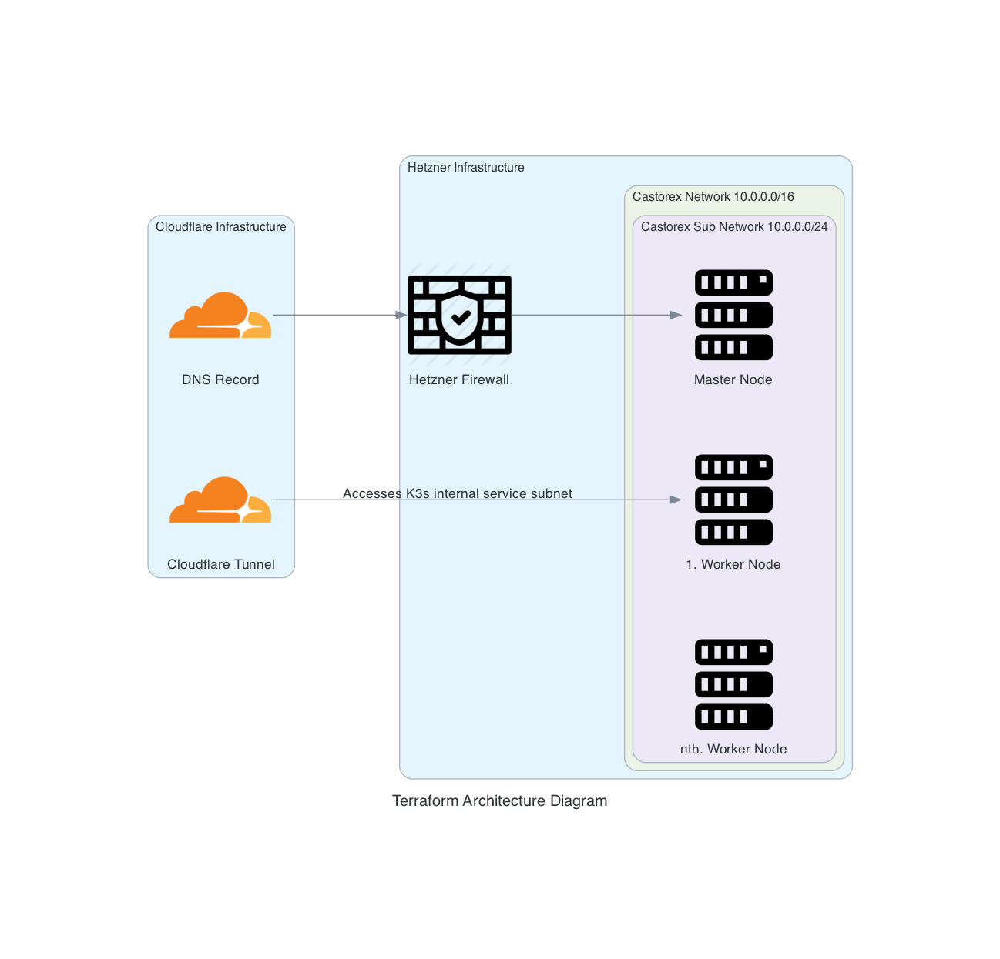
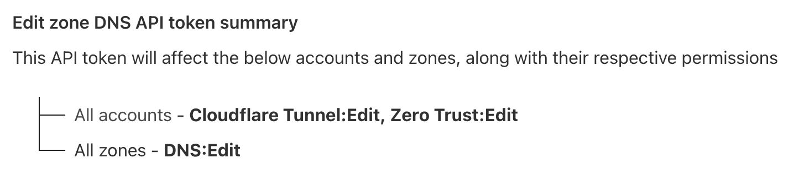
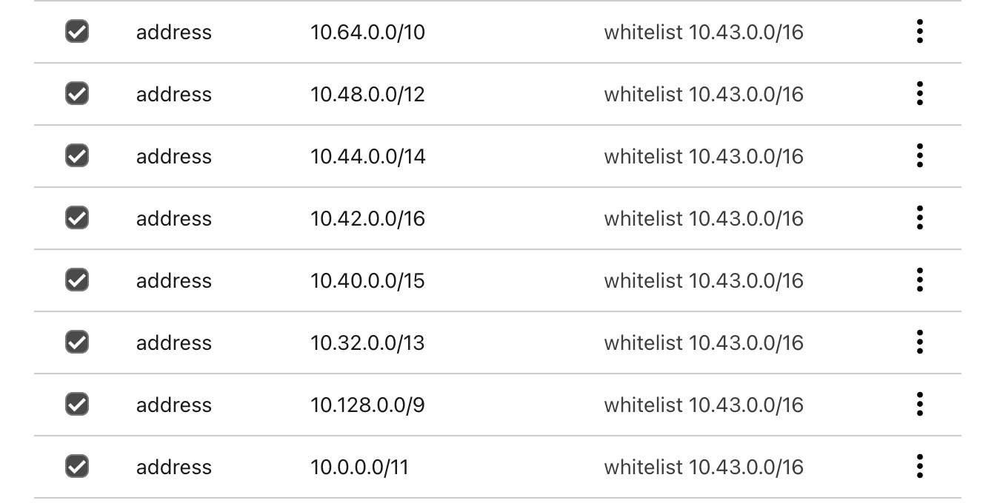

# Create k3s Cluster with Terraform and Ansible

# Infrastructure

Terraform creates the following resources:
- Hetzner Firewall
   - Allows Ingress on ports 80, 443, 22
   - Allows Egress on all ports (Hetzner default)
- Hetzner Network: 10.0.0.0/16
- Hetzner Subnetwork: 10.0.0.0/24
-  One Hetzner Server: Master Node
-  Hetzner Servers: Worker Nodes
   - Amount can be changed in terraform.tfvars
- Cloudflare DNS record
    - A RECORD for k3s.[domain.com]
    - CNAME RECORD for *.k3s.[domain.com] -> k3s.[domain.com]
- Cloudflare Tunnel
    - This Tunnel has access to the k3s internal service subnet and can access all services in the cluster.

Terraform also generates a ansible inventory file which is then used by ansible to deploy the k3s cluster with its default resources.



# Create Cluster with Ansible

The Ansible playbook will create a k3s cluster with the following resources:
- Cert Manager
- Cloudflared
- ArgoCD
    - https://argocd-server.argocd.svc.cluster.local/
- Traefik Dashboard
    - http://traefik.kube-system.svc.cluster.local:9000/dashboard/#/

# Setup

## 1. Setup configuration
1. Optain api tokens:
    - Hetzner: Create a project in the Hetzner Cloud Console [and under security create a API token](https://docs.hetzner.com/cloud/api/getting-started/generating-api-token/).
    - Cloudflare: [Create a API token](https://developers.cloudflare.com/fundamentals/api/get-started/create-token/) with the following permissions: 
    
    Cloudflare: [Find the account id in the cloudflare dashboard](https://developers.cloudflare.com/fundamentals/setup/find-account-and-zone-ids/)
2. Create a ssh key which will be used for the VMs.
    ```bash
    ssh-keygen -b 4096 -t rsa -f ssh_key -N ""
    ```
3. Rename terraform.tfvars.example to terraform.tfvars
4. Fill in the api tokens, cloudflare account ids and the ssh public key path
5. Change remaining variables as needed

## 2. Run Terraform
1. Make sure you are in the `terraform/` directory
2. Initialize the Terraform directory
    ```bash
    tofu init
    ```
3. Run terraform plan and apply
    ```bash
    tofu plan
    tofu apply
    ```

## 3. Run Ansible
1. Make sure you are in the `ansible/` directory
2. Install ansible dependencies
    ```bash
    ansible-galaxy install -r galaxy_deps.yml
    ```
3. Run the ansible playbook with the inventory file generated by terraform
    ```bash
    ansible-playbook -i inventory/inventory.yml site.yml
    ```

## 4. Setup Cloudflare Tunnel
1. Remove the Split tunnel configuration for internal k3s service subnet (`10.43.0.0/16`)

    `Zero Trust > Settings > Warp Client > Device Settings > [Edit Profile] > Split Tunnel > (Remove 10.0.0.0/8)`
2. (Optional) If you want to access network resources on a `10.0.0.0/8` network, while connected with Cloudflare Zero Trust, you can add exclude rules for the other ranges.

    

    This will exclude all ips from `10.0.0.0 - 10.42.255.255` and from `10.44.0.0 - 10.255.255`

3. Create Device Enrollment permissions to determine who can connect to your cloudflare Tunnel: 

    `Zero Trust > Settings > Warp Client > Device enrollment permissions`

